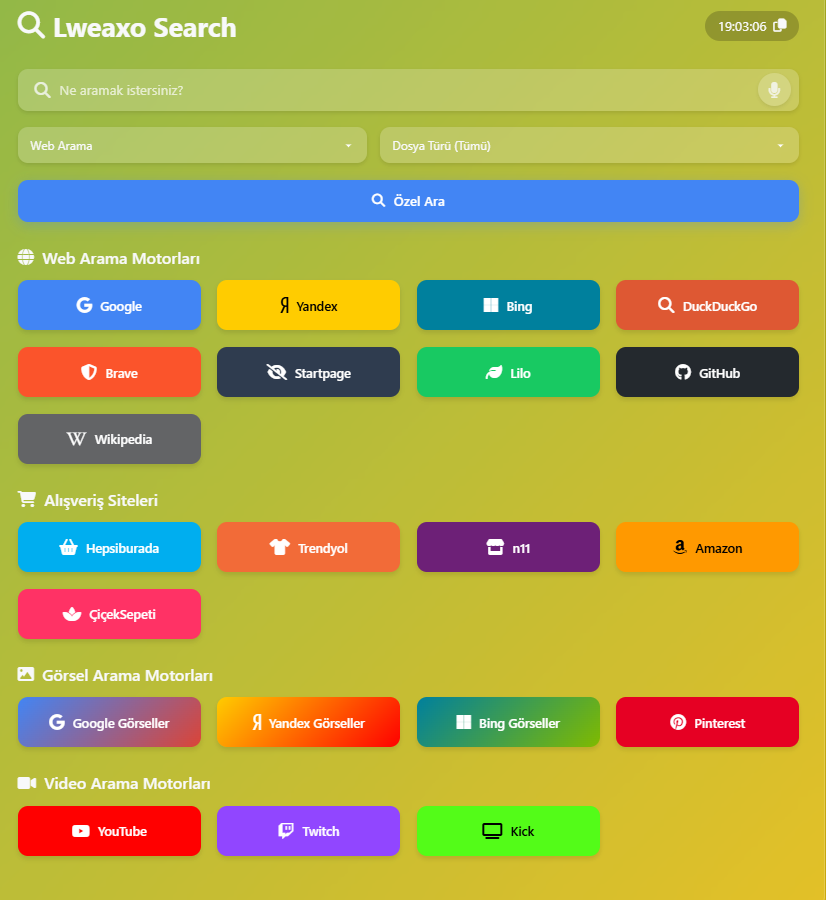

# 📜 Lweaxo Search - Çoklu Arama Motoru

  

**Lweaxo Search**, kullanıcıların tek bir arayüzden farklı arama motorlarını kullanabilmesini sağlayan modern ve şık bir web uygulamasıdır. Google, Yandex, Bing, YouTube, Twitch ve daha fazlasına tek yerden erişim sunar.

## ✨ Özellikler

- 🌐 **Çoklu Arama Motoru Desteği**: 10+ farklı arama motoru
- 🎨 **Modern Glassmorphism Tasarım**: Şık ve kullanıcı dostu arayüz
- 🎙️ **Sesli Arama**: Web Speech API ile entegrasyon
- ⏱️ **Gerçek Zamanlı Saat**: Kopyalama özelliği ile
- 📁 **Dosya Türü Filtreleme**: PDF, Word, Excel vb. özel aramalar
- 📱 **Tam Duyarlı Tasarım**: Tüm cihazlarda mükemmel görüntüleme
- 🎨 **Dinamik Renk Teması**: Geçişli gradient arkaplan

## 🛠️ Kurulum

1. Dosyayı masaüstüne çıkartın.
3. `index.html` dosyasını açın

## 🚀 Kullanım

1. Arama çubuğuna sorgunuzu yazın
2. İsteğe bağlı olarak arama türünü seçin (Web, Görsel, Video)
3. Dosya türü filtresi ekleyebilirsiniz
4. "Özel Ara" butonuna basın veya doğrudan istediğiniz arama motorunu seçin

## 🌟 Öne Çıkan Arama Motorları

- **Web**: Google, Yandex, Bing, DuckDuckGo, Brave
- **Görsel**: Google Görseller, Yandex Görseller, Pinterest
- **Video**: YouTube, Twitch, Kick

## 🛡️ Gizlilik

- Tüm aramalar doğrudan seçilen arama motoruna yönlendirilir
- Hiçbir arama verisi sunucularımızda saklanmaz
- Sesli arama tamamen tarayıcı içinde işlenir

## 📜 Lisans

Bu proje MIT lisansı altında lisanslanmıştır - detaylar için [LICENSE](LICENSE) dosyasına bakın.

## 📞 İletişim

---

**Lweaxo Search** - Tek yerden tüm aramalarınız için modern çözüm! 🔍✨